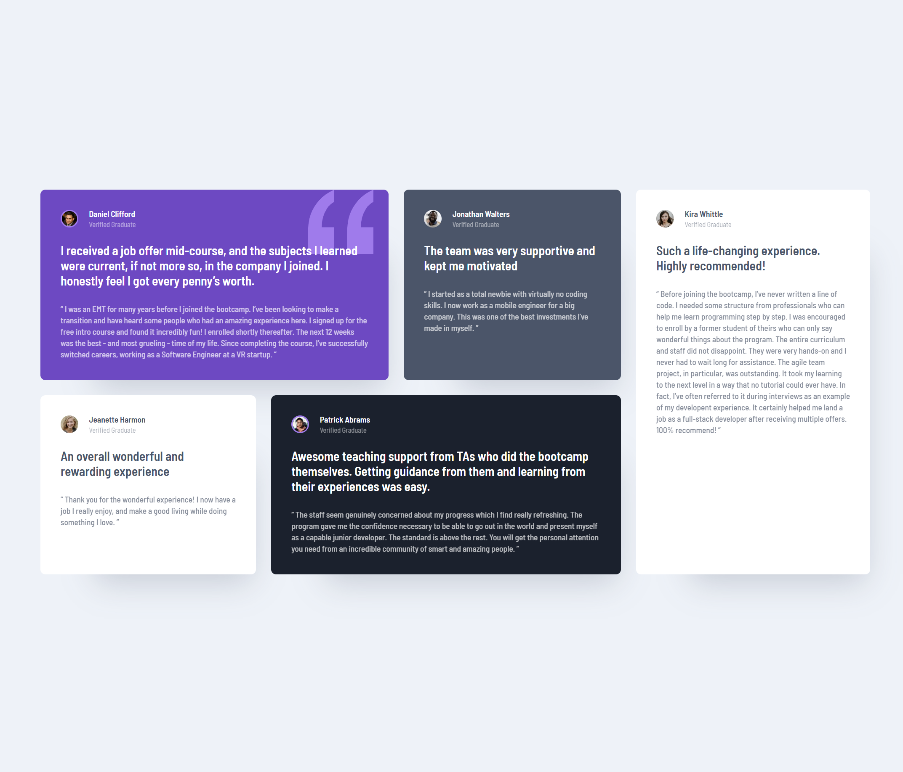

# four-card-feature-section

## Table of contents

- [Overview](#overview)
  - [Screenshot](#screenshot)
  - [Links](#links)
- [My process](#my-process)
  - [Built with](#built-with)
- [Author](#author)

## Overview

This project involved creating a visually engaging testimonial grid layout using HTML and CSS. The aim was to build a responsive design that showcased user testimonials in a structured and appealing manner.

## Features:

1. Design:

   - A five-card grid layout where each card contains user testimonials and experiences.
   - Unique styling for each card to differentiate user testimonials visually.

2. Typography & Styling:

   - Custom fonts enhancing readability and aesthetics.

3. Responsive Design:

   - Layout adapts for various screen sizes using media queries.
   - Adjustments for smaller devices include image resizing and layout simplifications.

### Screenshot

### Links

- Live Site URL: (https://testimonials-grid-section-iota-ruddy.vercel.app/)

## My process

Approach:
I started by structuring the page with semantic HTML, making it easy to understand and accessible. Each testimonial was designed as a separate card with user details, a summary, and a detailed experience. I used CSS Grid to create the overall layout, which gave me flexibility in arranging the cards, and Flexbox within the cards to keep everything aligned and spaced properly. I followed a mobile-first approach, using media queries to make the design adapt smoothly to larger screens. To make each card stand out while keeping a consistent look, I added unique styles and background elements.

### Built with

- Semantic HTML5 markup
- CSS
- Flexbox
- Grid

## Author

- Website - [Rodel Advincula](https://testimonials-grid-section-iota-ruddy.vercel.app/)
